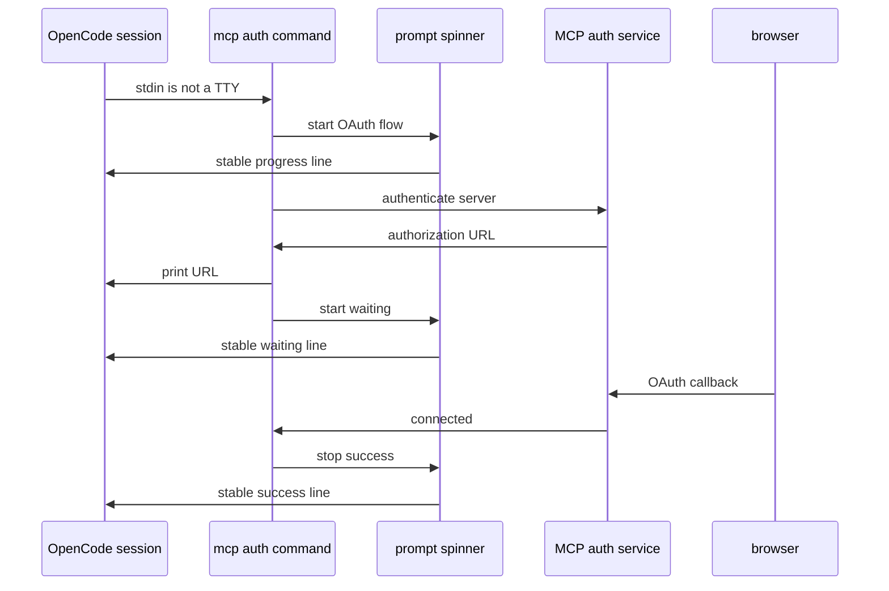

# Reduce MCP Auth Spinner Output

## Goal

Make `opencode mcp auth <server> --yes` avoid animated spinner frames when
stdin is not a TTY, including when it is launched by an OpenCode session. The
command must still make its OAuth wait state visible and must flush that output
promptly.

## Current Behavior

`packages/opencode/src/cli/cmd/mcp.ts` creates a Clack spinner before starting
the OAuth flow. During authorization, Clack redraws the spinner on a timer.
When a caller captures progress output, those redraws become a long sequence of
spinner frames rather than an updateable terminal line.

The relevant command path is `McpAuthCommand` at
`packages/opencode/src/cli/cmd/mcp.ts:170`.

## Design

Treat `process.stdin.isTTY` as the interaction boundary. A CLI launched with
non-TTY stdin must use stable, newline-terminated progress messages even if its
stdout or stderr happens to be attached to a pseudo-terminal.

Extend the existing CLI prompt abstraction rather than duplicating this branch
in the MCP command. In interactive mode it retains the existing Clack spinner.
In noninteractive mode it writes each progress transition once to stderr using
the existing prompt logging path, which is flushed by Node/Bun stream writes.

Proposed types and signatures in `packages/opencode/src/cli/effect/prompt.ts`:

```ts
export interface Progress {
  start(message: string): Effect.Effect<void>
  stop(message: string, code?: number): Effect.Effect<void>
}

export const spinner = (): Progress
```

`spinner()` will select its implementation from `process.stdin.isTTY`:

- `true`: wrap `@clack/prompts`' existing spinner unchanged.
- `false`: `start(message)` emits one stable progress line; `stop(message)`
  emits the terminal status line, preserving the existing optional status code
  behavior where applicable.

Do not emit periodic dots initially. The two OAuth state transitions are
sufficient progress, avoid unbounded output for an abandoned authorization,
and the browser authorization URL remains printed before the wait state.

## Implementation Steps

1. Update `packages/opencode/src/cli/effect/prompt.ts` so `spinner()` returns a
   `Progress` implementation that uses a stable log/write path when
   `!process.stdin.isTTY`.
2. Keep the `McpAuthCommand` call sites in
   `packages/opencode/src/cli/cmd/mcp.ts` unchanged. They already call
   `start("Starting OAuth flow...")`, stop to print the authorization URL, then
   call `start("Waiting for authorization...")`, and finally `stop(...)`.
3. Add a focused unit test for the prompt progress abstraction that exercises
   both branches. Assert noninteractive progress produces no terminal-control
   sequences or repeated redraw frames, and that its start and stop messages
   are newline-delimited.
4. Add or extend a CLI subprocess test for `mcp auth` with a controlled OAuth
   server. Spawn it with non-TTY stdin, reach the authorization callback, and
   assert stderr contains each wait-state message once before successful
   completion.
5. Run the focused CLI tests and `bun typecheck` from
   `packages/opencode`.

## Expected Call Trace



Interactive terminals follow the same command trace but use Clack's animated
spinner implementation.

## Acceptance Criteria

- `opencode mcp auth cf-portal --yes` produces no spinner frames when stdin is
  not a TTY.
- Noninteractive output contains a clearly flushed `Starting OAuth flow...`,
  `Waiting for authorization...`, and terminal success or failure message.
- Interactive terminal behavior remains unchanged.
- The change applies to all CLI users of `Prompt.spinner()`, not only MCP auth.
